# 🛒 TeknoForce E-Commerce Platformu

TeknoForce, ASP.NET Core Razor Pages kullanılarak geliştirilmiş, ürün yönetimi, içerik kontrolü ve yönetim süreçlerini kapsayan kapsamlı bir web uygulamasıdır.  

Bu proje, gerçek bir e-ticaret altyapısının temel bileşenlerini modellemek amacıyla geliştirilmiş olup; kullanıcı tarafında ürünlerin sergilenmesi ve admin panel üzerinden tüm veri akışının yönetilmesini sağlayan uçtan uca bir sistem sunmaktadır.

---

## 🎯 Proje Yaklaşımı

TeknoForce geliştirilirken yalnızca bir arayüz oluşturmak değil, aynı zamanda sürdürülebilir, yönetilebilir ve genişletilebilir bir sistem mimarisi kurmak hedeflenmiştir.  

Bu doğrultuda veri yönetimi, modüler yapı, ilişkisel veritabanı tasarımı ve backend süreçlerinin kontrollü ilerlemesi ön planda tutulmuştur.

---

## 🧩 Sistem Özellikleri

### 👤 Kullanıcı Deneyimi
- Ürünlerin dinamik olarak listelenmesi  
- Detay sayfaları üzerinden ürün bilgilerine erişim  
- İçeriklerin veritabanı tabanlı olarak yönetilmesi  
- Kullanıcıya sade ve anlaşılır bir arayüz sunulması  

### ⚙️ Yönetim Paneli (Admin)
- Ürün, kategori ve marka yönetimi  
- Sipariş süreçlerinin kontrolü  
- Yorum ve değerlendirme yönetimi  
- İletişim bilgileri (şube ve telefon) yönetimi  
- Dashboard üzerinden sistem verilerinin genel takibi  

---

## 🛠 Kullanılan Teknolojiler

- ASP.NET Core Razor Pages  
- Entity Framework Core  
- Microsoft SQL Server (LocalDB)  
- Bootstrap  

---

## 🏗 Teknik Yapı

Proje geliştirme sürecinde aşağıdaki teknik prensiplere odaklanılmıştır:

- Entity Framework Core ile ilişkisel veritabanı yönetimi  
- Migration tabanlı veri kontrolü ve versiyonlama  
- Razor Pages ile modüler ve okunabilir sayfa yapısı  
- CRUD işlemlerinde düzenli ve sürdürülebilir kod organizasyonu  
- Backend süreçlerinin kontrollü ve adım adım geliştirilmesi  

---

## 🌐 Canlı Demo

👉 http://www.teknoforceboya.com/

---

## 📸 Ekran Görüntüleri

### 🔐 Admin Giriş
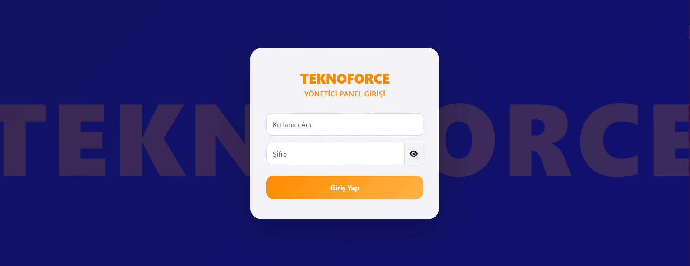

### 📊 Dashboard
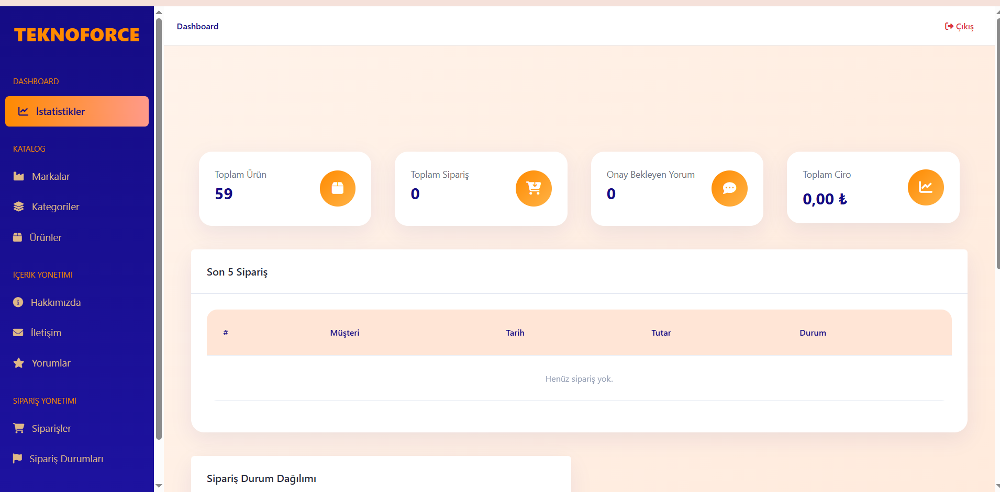

### 📁 Kategoriler (Admin)
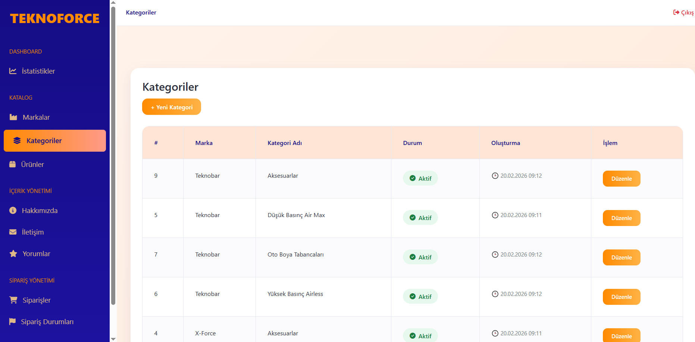

### 🏢 Şubeler
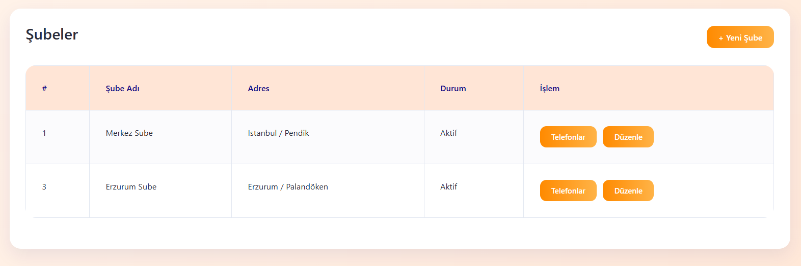

---

### 🌐 Ana Sayfa

### 🏷 Markalar
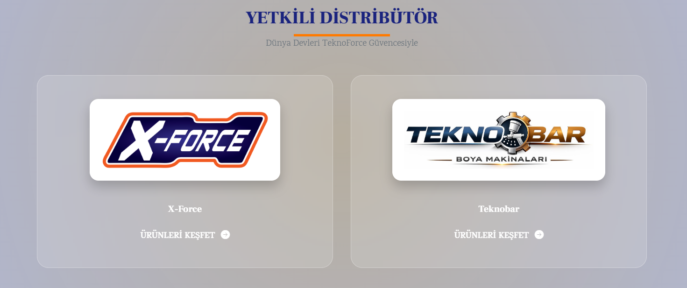

### 🎧 Teknik Destek

---

### 📦 Kategoriler
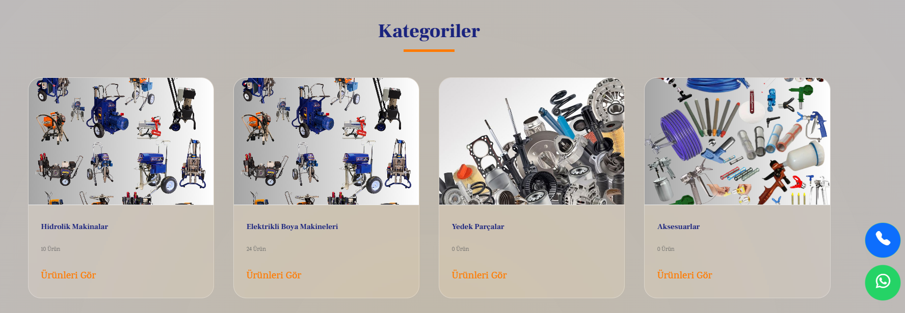

### 🛍 Ürünler
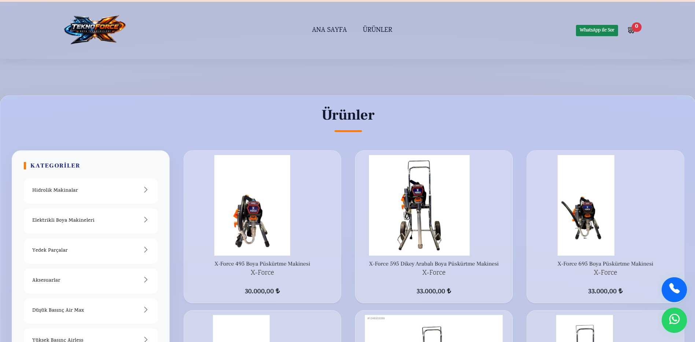

### 🛍 Ürünler (Devam)
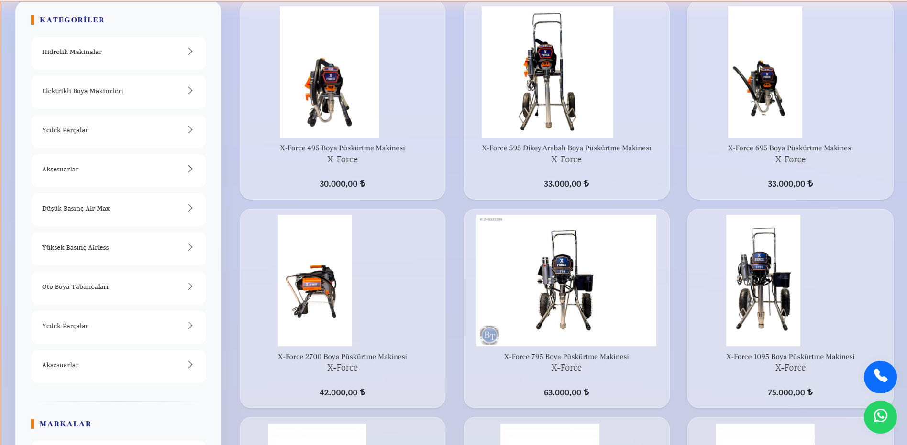

---

### 🔍 Ürün Detay
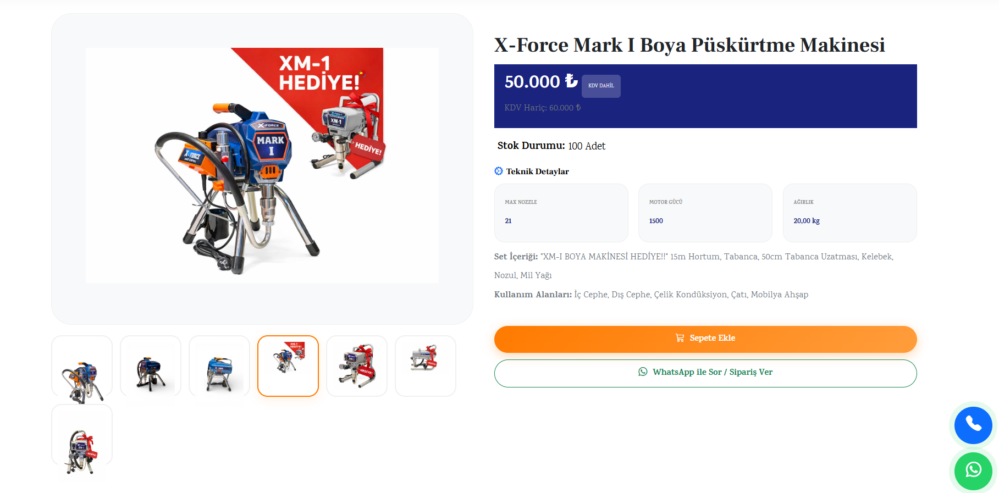

### 💬 Yorumlar
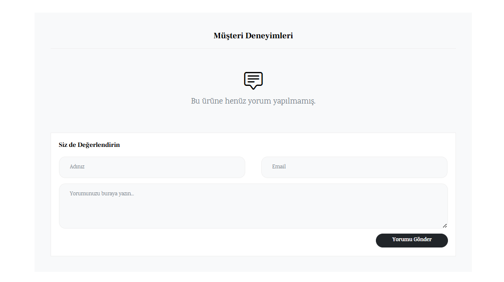

---

### 🛒 Sepet
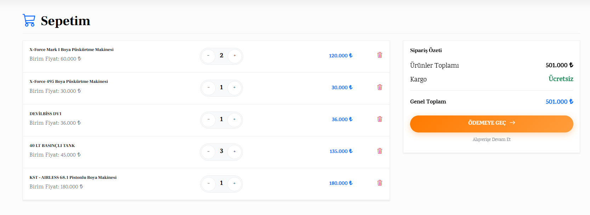

### 📦 Sipariş
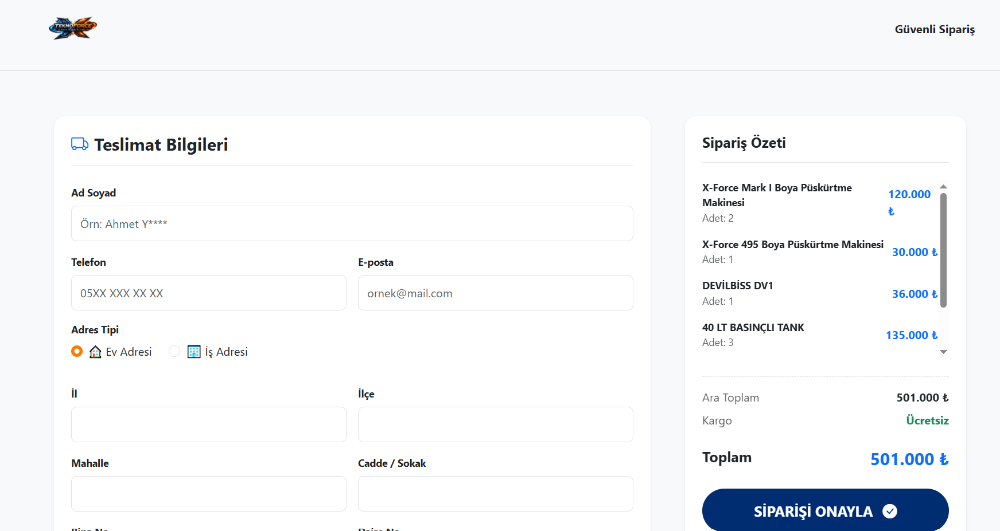

---

### 📱 WhatsApp Entegrasyon
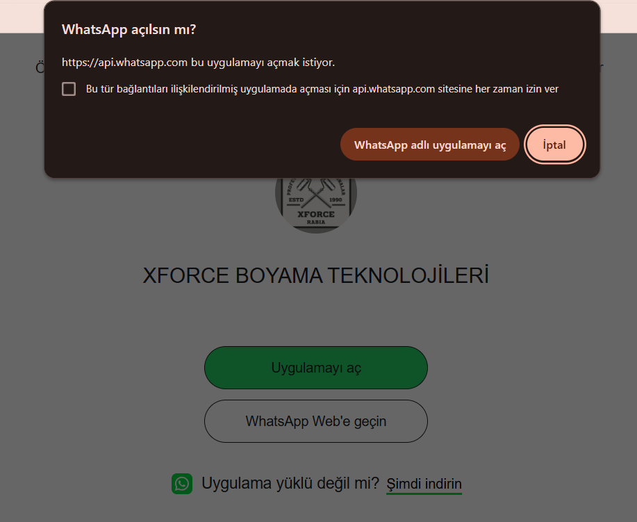

---

## 💡 Genel Değerlendirme

TeknoForce, sadece bir arayüz projesi değil; veri yönetimi, sistem kurgusu ve backend geliştirme süreçlerini içeren bütünsel bir web uygulaması olarak tasarlanmıştır.  

Proje, özellikle admin panel geliştirme, veritabanı ilişkileri ve backend mimarisi konularında güçlü bir temel oluşturmayı hedeflemektedir.

---

## 👩‍💻 Geliştirici

**Helin Ergön**
